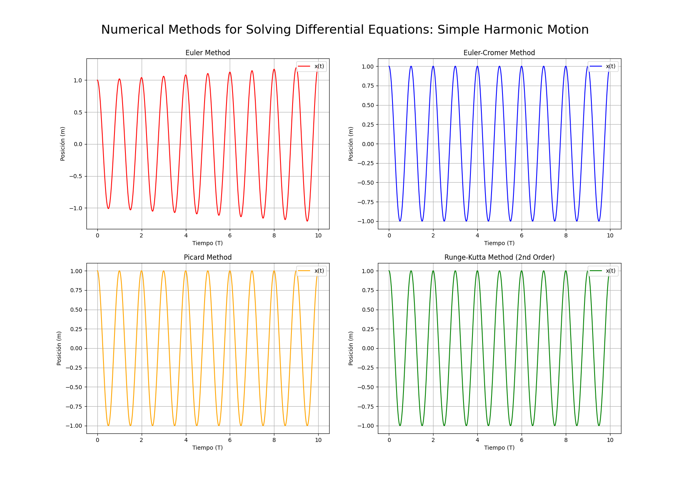

# Numerical Methods for Differential Equations

Comparison of different numerical methods for solving differential equations using the Simple Harmonic Motion model.

## Methods Implemented

- Euler Method
- Euler-Cromer Method
- Picard Method
- Runge-Kutta Method 2nd Order
- Runge-Kutta Method 4th Order

## Technologies

- Python
- NumPy
- Matplotlib

## Example

